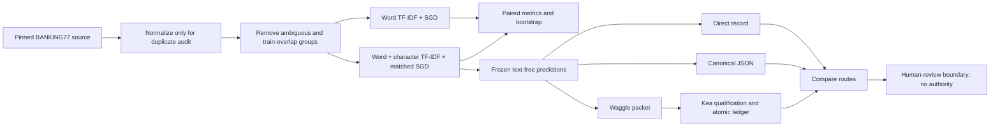

# Waggle + Kea

[](https://github.com/willykeenan/waggle-kea/actions/workflows/ci.yml)
[](https://github.com/willykeenan/waggle-kea/actions/workflows/benchmark.yml)
[](https://github.com/willykeenan/waggle-kea/actions/workflows/codeql.yml)

Inspectable machine coordination, a fail-closed audit layer, and a reproducible
banking intent-classification benchmark.

- **Waggle** defines compact, typed coordination packets built from symbolic
  state deltas and content-addressed references.
- **Kea** qualifies each handoff, records a hash-chained replay trail, exposes
  failures, and never grants execution authority.
- **The BANKING77 benchmark** trains matched classifiers on public banking
  queries, measures uncertainty and selective routing, and audits every frozen
  prediction through direct, JSON, and Waggle/Kea paths.

## Results at a glance

| Evaluation | Result | Boundary |
| --- | --- | --- |
| Primary ML comparison | Macro-F1 `0.8915 → 0.9119`; paired delta `+0.0203`, 95% bootstrap interval `[+0.0140, +0.0274]` | Exploratory, test-informed design; not confirmatory |
| Data controls | 3,050 unique, unambiguous test cases after removing 25 normalized train/test overlaps | Official BANKING77 data; no private institutional or customer data |
| Negative control | Shuffled-label macro-F1 `0.0095` | Passed the frozen `≤ 0.05` leakage tripwire |
| Typo stress | Candidate macro-F1 `0.8565`; word-only `0.7728` | One deterministic synthetic deletion, not natural-noise validation |
| Audited handoff | 3,050/3,050 routes agreed; 0 clean rejections; 0 authority grants | Exact routing parity is not a model-quality claim |
| Fault suite | 384/384 specified detectable mutations rejected; 0 false accepts | Finite suite, not adversarial-security validation |

The complete result includes all five fixed seeds, 2,000 paired bootstrap
draws, accuracy, top-3 accuracy, log loss, multiclass Brier score, 15-bin ECE,
risk–coverage curves, all 77 per-intent scores, a shuffled-label control, and
text-free case-level predictions. See
[`benchmarks/banking77/`](benchmarks/banking77/README.md).

## Reproduce

Requires Node.js 22 or 24. The fast path validates the implementation, coverage
gates, committed ML evidence, research checksums, dependency audit, and packed
consumer interface:

```bash
npm ci
npm run reproduce
```

To retrain the matched classifiers and generate a fresh local result:

```bash
npm run benchmark:banking77
```

The first benchmark run creates an ignored Python environment, installs the
pinned scientific stack, and downloads three digest-verified files from the
pinned official BANKING77 commit. Generated results go to an ignored local
directory, so reproduction does not rewrite the committed reference.

## Evaluation design



The primary comparison changes only the feature representation: word
unigrams/bigrams versus the same word features plus character-boundary
3–5-grams. Both use the same seeded log-loss SGD configuration. The design is
explicitly exploratory because aggregate test performance informed the first
public protocol.

## Protocol and failure behavior

Waggle v0 uses canonical JSON, SHA-256 content identity, symbolic tokens, and
closed-world runtime schemas. Kea treats decoded output as an inspectable
artifact rather than permission to act.

| Boundary | Behavior |
| --- | --- |
| Unknown fields or invalid symbolic values | Rejected before ledger mutation |
| Payload hash or byte-count mismatch | Rejected before decoding |
| Reused message ID or idempotency-key collision | Exact retry replays; altered content fails closed |
| Missing, duplicate, self, or cross-mission causal parent | Rejected |
| Message/interpretation persistence | Committed as one guarded atomic ledger batch |
| Deterministic decoder mismatch | Rejected; decoder-reported parity is diagnostic only |
| Policy verification | Explicitly `not-evaluated` unless an independent check ran |
| HTTP boundary | Typed safe errors, strict limits, read-only by default, opt-in fixture writes |
| Authority | `authorityGranted` is always `false`; tests execute zero effects |

Content hashes and hash chaining detect accidental or retrospective mutation;
they do not authenticate a permitted writer. The benchmark includes a fully
rehashed forged-payload control and correctly records that limitation as
undetected without a separate trust root.

## Use the reference implementation

This is a source-first GitHub release, not a published npm package.

```bash
npm run demo
npm run kea -- evaluate
npm run kea -- serve --port 7462
```

Fixture writes are disabled by default. The local viewer exposes health,
registry, message-list, replay, and deterministic-evaluation routes. Restart
with `--allow-fixtures` only when deliberately exercising sanitized local
fixture writes.

```ts
import {
  createWaggleV0FixtureKea,
  createWaggleV0Message,
  type WaggleV0Packet,
} from "waggle-kea";

const packet: WaggleV0Packet = {
  protocol: "waggle.v0",
  messageClass: "state-delta",
  intent: "propose",
  operation: "case.review",
  references: {
    context: ["context_case_17"],
    artifacts: ["artifact_summary_17"],
    evidence: ["evidence_policy_4"],
  },
  delta: { status: "review_required", confidenceBand: "low" },
};

const message = createWaggleV0Message({
  missionId: "mission_client_case",
  workNodeId: "work_triage",
  senderAgentId: "agent_analysis",
  receiverActorIds: ["human_reviewer"],
  contextPackId: "context_case_17",
  packet,
});

const { service } = createWaggleV0FixtureKea();
const result = service.ingest(message);
console.log(result.interpretation.disposition); // verified
console.log(result.interpretation.authorityGranted); // false
```

## Repository map

| Path | Purpose |
| --- | --- |
| [`benchmarks/banking77/`](benchmarks/banking77/README.md) | Reproducible classifier, protocol, controls, reference results, and audited handoff |
| `src/waggle/` | Typed packets, validation, encoding, composition, and message construction |
| `src/kea/` | Registry, qualification service, atomic replay ledger, CLI, API, and viewer |
| `tests/` | Protocol-integrity, HTTP-boundary, benchmark-evidence, and failure-mode tests |
| [`research/`](research/README.md) | Separate bounded native-prefix pilot, negative result, and claim ledger |
| `scripts/` | Evidence verification and clean package-consumer smoke tests |

## Limits and non-claims

The public BANKING77 result does not establish performance on private customer
data, production routing quality, customer benefit, demographic fairness,
accessibility, regulatory compliance, cross-domain generalization, or natural
noise robustness. The protocol is fixture-only and is not an authorization or
production-security boundary.

The separate native-prefix pilot in [`research/`](research/README.md) reports
one model/hardware run that beat repeated full-text reconstruction but did not
beat the stronger cached-prefix or warmed fresh-native controls. It does not
establish a universal agent language, cross-model compatibility, or token,
cost, latency, memory, energy, or overall-efficiency savings.

## License and citation

Code is MIT licensed. Research text is CC BY 4.0. BANKING77 attribution and its
CC BY 4.0 source license are recorded in
[`THIRD_PARTY_NOTICES.md`](benchmarks/banking77/THIRD_PARTY_NOTICES.md).
Citation metadata is provided in [`CITATION.cff`](CITATION.cff).
