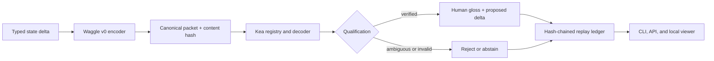

# Waggle + Kea

[](https://github.com/willykeenan/waggle-kea/actions/workflows/ci.yml)

An open-source, fixture-only reference implementation for inspectable machine
coordination.

- **Waggle** defines compact, typed coordination packets built from symbolic
  state deltas and content-addressed references.
- **Kea** separately registers the codec, decodes and verifies each packet,
  records a hash-chained replay trail, exposes uncertainty and failures, and
  never grants execution authority.

The point is not to make machine communication mysterious. The point is to
test whether coordination can become smaller and more structured while
remaining legible, replayable, and fail-closed.

## What is implemented

- Canonical JSON encoding and SHA-256 content identity.
- A schema-constrained Waggle v0 packet format that rejects prose-bearing
  payload fields and invalid symbolic values.
- Deterministic encode/decode and sequence or bundle composition.
- A Kea codec registry with immutable, integrity-checked manifests.
- Exact decoder qualification for deterministic Waggle v0 fixtures.
- Hash-chained message, interpretation, and correction history.
- Idempotent ingest and collision rejection.
- Unknown-codec, payload-size, out-of-distribution, and undecodable-capacity
  failure modes.
- A local CLI, read-only HTTP viewer, replay API, and deterministic evaluation
  harness.
- Zero model calls, network calls, or authority execution in the tests.

## Architecture



Kea's interpretation is an observable artifact, not an action. Any real system
using the protocol would still need a separate authorization and execution
boundary.

## Quickstart

Requires Node.js 20 or newer.

```bash
npm install
npm run check
npm run demo
```

Run the standalone Kea evaluation:

```bash
npm run kea -- evaluate
```

Start the local fixture viewer:

```bash
npm run kea -- serve --port 7462
```

Fixture writes are disabled by default. To deliberately add a sanitized local
fixture, restart with `--allow-fixtures` and use the documented fixture-only
API or CLI.

## Example

```ts
import {
  createWaggleV0FixtureKea,
  createWaggleV0Message,
  type WaggleV0Packet,
} from "waggle-kea";

const packet: WaggleV0Packet = {
  protocol: "waggle.v0",
  messageClass: "state-delta",
  intent: "propose",
  operation: "case.review",
  references: {
    context: ["context_case_17"],
    artifacts: ["artifact_summary_17"],
    evidence: ["evidence_policy_4"],
  },
  delta: { status: "review_required", confidenceBand: "low" },
};

const message = createWaggleV0Message({
  missionId: "mission_client_case",
  workNodeId: "work_triage",
  senderAgentId: "agent_analysis",
  receiverActorIds: ["human_reviewer"],
  contextPackId: "context_case_17",
  packet,
});

const { service } = createWaggleV0FixtureKea();
const result = service.ingest(message);
console.log(result.interpretation.disposition); // verified
```

## Research status

This release demonstrates a deterministic protocol and audit harness on
sanitized fixtures. It is not a learned latent language and it does not
establish lower total cost, lower latency, better task outcomes, production
readiness, cross-model compatibility, or security under adversarial traffic.

Those are empirical questions. A credible comparison requires matched models,
tasks, tools, context, stopping rules, quality review, complete resource
accounting, and Kea's decoding overhead included in the total.

## Explicit non-claims

This repository does **not** claim:

- access to private model reasoning, hidden states, or provider caches;
- that arbitrary models share a universal latent language;
- token, cost, latency, memory, or energy savings;
- production Agent traffic or autonomous execution;
- that a decoded message grants permission to act;
- quantum computation or quantum speedup.

## Related research

The companion [`research/`](research/README.md) package
documents the broader research ladder, controls, bounded results, negative
results, and claim ledger.

## Repository map

| Path | Purpose |
| --- | --- |
| `src/waggle/` | Typed packets, validation, encoding, composition, and message construction |
| `src/kea/` | Registry, decoder service, replay ledger, evaluation, CLI, API, and viewer |
| `examples/demo.ts` | End-to-end sanitized coordination fixture |
| `tests/` | Deterministic protocol, audit, and failure-mode tests |
| `CITATION.cff` | Citation metadata |
| `SECURITY.md` | Security boundary and reporting guidance |

## License

MIT. See [`LICENSE`](LICENSE).
